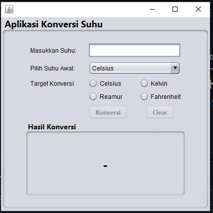

# Aplikasi Konversi Suhu

Aplikasi ini adalah aplikasi konversi suhu berbasis Java dengan antarmuka grafis (GUI) yang dibuat menggunakan `JFrame` di NetBeans. Aplikasi ini memungkinkan pengguna memasukkan nilai suhu dalam satu skala (Celsius, Fahrenheit, Kelvin, atau Reamur) dan mengonversinya ke skala lain yang dipilih. Aplikasi ini dilengkapi dengan fitur validasi input, konversi otomatis, serta tombol untuk membersihkan input.

## Fitur

1. **Validasi Input**: Hanya menerima nilai angka, termasuk angka desimal.
2. **Pemilihan Skala Suhu**: Pengguna dapat memilih skala suhu awal (Celsius, Fahrenheit, Kelvin, atau Reamur) dan skala tujuan konversi.
3. **Tombol Konversi**: Melakukan konversi dari nilai input ke skala tujuan yang dipilih.
4. **Tombol Bersihkan**: Menghapus semua input dan hasil konversi.
5. **Konversi Otomatis**: Setelah diaktifkan, aplikasi akan melakukan konversi otomatis setiap kali nilai input diubah.
6. **Aktivasi Tombol Secara Kondisional**: Tombol Konversi dan Bersihkan hanya aktif ketika ada input yang valid di bidang input.

## Komponen GUI

- **JTextField** (`txtInput`): Tempat pengguna memasukkan nilai suhu.
- **JComboBox** (`cbInputScale`): Memilih skala suhu awal dari nilai yang dimasukkan.
- **JRadioButton** (`rbToCelsius`, `rbToFahrenheit`, `rbToKelvin`, `rbToReamur`): Memilih skala tujuan konversi.
- **JButton Convert** (`btnConvert`): Mengonversi nilai suhu ke skala tujuan.
- **JButton Clear** (`btnClear`): Menghapus bidang input dan output.
- **JLabel Output** (`lblOutput`): Menampilkan hasil konversi.

## Cara Menggunakan

1. **Pilih Skala Awal**: Gunakan dropdown untuk memilih skala suhu awal dari nilai yang ingin dikonversi.
2. **Masukkan Nilai Suhu**: Masukkan nilai suhu numerik ke dalam `txtInput`. Hanya angka dan desimal yang diterima.
3. **Pilih Skala Tujuan**: Pilih skala tujuan menggunakan radio button.
4. **Lakukan Konversi**:
    - **Klik Tombol Konversi**: Ini akan mengonversi nilai suhu ke skala tujuan dan menampilkan hasilnya pada `lblOutput`.
    - **Konversi Otomatis**: Setelah tombol Konversi ditekan, aplikasi akan otomatis menghitung ulang konversi setiap kali nilai input diubah.
5. **Bersihkan Input**: Klik tombol Bersihkan untuk mereset semua input, output, dan menonaktifkan konversi otomatis.

## Penjelasan Kode

- **Validasi Input**: Menggunakan `KeyListener` untuk memastikan hanya angka yang diterima di bidang input.
- **Logika Aktivasi Tombol**: Menggunakan `DocumentListener` untuk memantau perubahan di `txtInput` agar tombol Konversi dan Bersihkan diaktifkan/nonaktifkan sesuai kondisi input.
- **Logika Konversi**: Metode `convertTemperature` melakukan konversi suhu berdasarkan skala yang dipilih.
- **Konversi Otomatis**: Dikendalikan oleh flag boolean `autoConvertEnabled` yang mengaktifkan/menonaktifkan konversi otomatis ketika input berubah.

## Screenshot Aplikasi
### Tampilan Awal Program

### Memasukkan Suhu, Memilih Suhu Awal dan Target Konversi, Lalu Menjalankan Konversi

## Logika Konversi Suhu

Aplikasi menggunakan rumus konversi berikut:

- Celsius ke Fahrenheit: `F = C * 9/5 + 32`
- Celsius ke Kelvin: `K = C + 273.15`
- Celsius ke Reamur: `R = C * 4/5`
- Fahrenheit ke Celsius: `C = (F - 32) * 5/9`
- Fahrenheit ke Kelvin: `K = (F - 32) * 5/9 + 273.15`
- Fahrenheit ke Reamur: `R = (F - 32) * 4/9`
- Kelvin ke Celsius: `C = K - 273.15`
- Kelvin ke Fahrenheit: `F = (K - 273.15) * 9/5 + 32`
- Kelvin ke Reamur: `R = (K - 273.15) * 4/5`
- Reamur ke Celsius: `C = R * 5/4`
- Reamur ke Fahrenheit: `F = R * 9/4 + 32`
- Reamur ke Kelvin: `K = R * 5/4 + 273.15`

## Persyaratan

- **Java Development Kit (JDK)**: Versi 8 atau lebih tinggi.
- **NetBeans**: IDE untuk pengembangan GUI Java.

## Langkah Memulai

1. Clone repository atau unduh file proyek ini.
2. Buka proyek di NetBeans.
3. Jalankan file `SuhuConverter.java` untuk memulai aplikasi.

## Pengembangan di Masa Mendatang

- Menambahkan lebih banyak skala suhu.
- Memberikan validasi tambahan untuk nilai ekstrem atau tidak realistis.
- Meningkatkan tampilan UI dengan gaya dan tata letak yang lebih baik.

## Lisensi

Proyek ini bersifat open-source dan dapat dimodifikasi serta didistribusikan.
